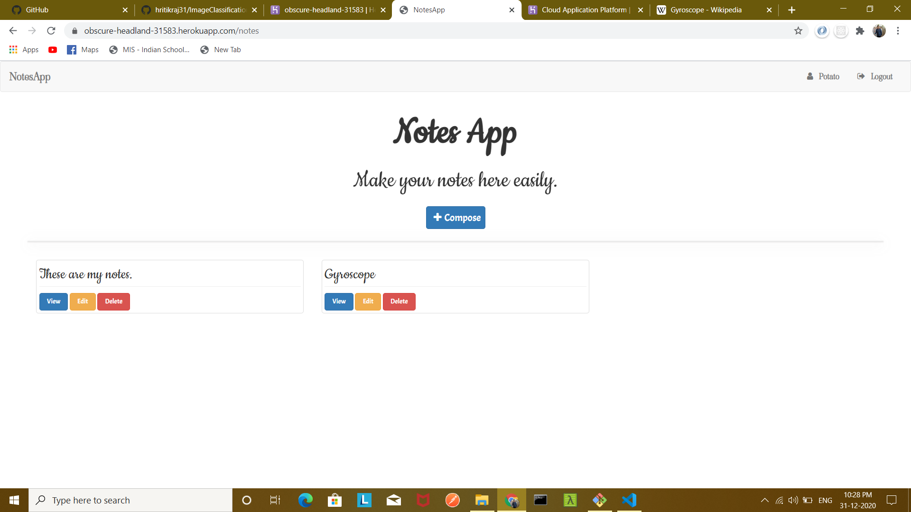

# NotesApp

This is website for making and managing notes. It includes an online editor which have several tools like bold, italic, font-size, font-weight, color etc.

## View Live App

Hosted app at https://obscure-headland-31583.herokuapp.com/

## Tech Stack Used

### Backend

* [MongoDB](https://docs.mongodb.com/) - Document database - to store data as JSON. Used for storing user data and notes.
* [Express.js](https://devdocs.io/express/) - Back-end web application framework running on top of Node.js. For template rendering ejs has been used
* [Node.js](https://nodejs.org/en/docs/) - JavaScript runtime environment(Server)

### Middleware

* [Mongoose](https://mongoosejs.com/docs/guide.html) - ODM for MongoDB

### Frontend

* Frontend has been completely made using pure HTML, Javascript and CSS. All the tools functions have been implemented using executeCommand function provided by DOM.

---

